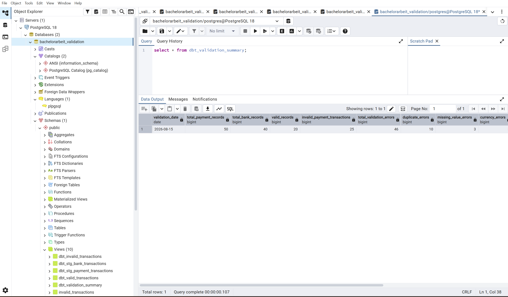
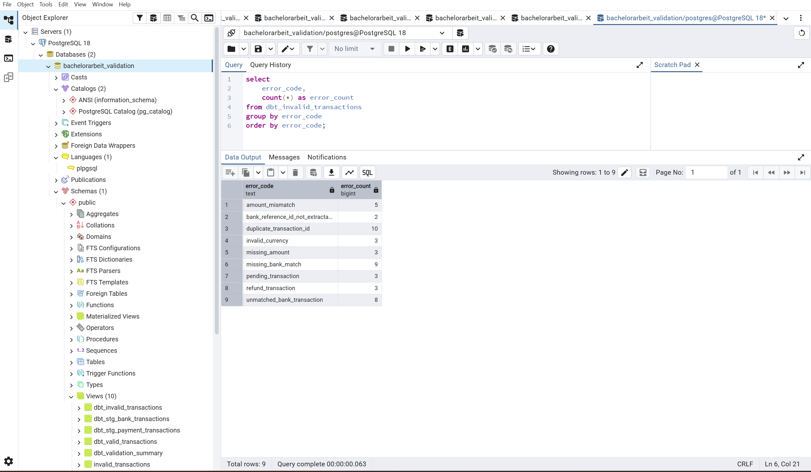

# SQL-basierte Validierung von Transaktionsdaten aus Payment-Provider-APIs und Bankexporten


Prototyp zur automatisierten SQL-basierten Validierung von Finanztransaktionsdaten aus zwei heterogenen Quellen
(Payment-Provider-API und Bankexport), entstanden im Rahmen meiner Bachelorarbeit im Studiengang Ingenieurinformatik
an der HTW Berlin (Fachbereich 2). Ziel des Projekts ist es, typische Datenqualitätsprobleme in Transaktionsdaten
automatisiert zu erkennen und dadurch eine zuverlässigere Grundlage für die Finanzberichterstattung zu schaffen.

## Was dieses Projekt zeigt

- **Datenpipeline-Design**: dreistufige Architektur (Rohdaten → Staging → Validierung) mit klarer Trennung der
  Verantwortlichkeiten
- **SQL-Validierungslogik**: neun eigenständig definierte Validierungsregeln zur Erkennung von Datenqualitätsproblemen
  (u. a. doppelte Transaktions-IDs, fehlende Beträge, Währungsabweichungen, nicht zuordenbare Bankreferenzen)
- **Zwei parallele Umsetzungen derselben Logik**: reines SQL (Views) und ein äquivalentes dbt-Projekt mit
  automatisierten Tests — zeigt den Übergang von manuellem SQL zu einem modernen, versionierten Analytics-Engineering-Workflow
- **Python-Datenintegration**: CSV-Import-Pipelines sowie ein Proof of Concept für den Import über die Stripe-Test-API
- **Reproduzierbarkeit**: vollständige Testdaten, dokumentierte Fehlerfälle und eine Evaluation anhand von 90
  Testdatensätzen mit gezielt eingebauten Fehlern

## Ordnerstruktur

```
python_import/          Python-Skripte für Datengenerierung, CSV-Import und Stripe-Test-API-Import
powershell_skripte/     Hilfsskript zur Ausführung der Import-Pipeline für den großen Testdatensatz
sql_views/              SQL-Views für Staging und Validierung (reine SQL-Umsetzung, ohne dbt)
dbt_validation_pipeline/ dbt-Projekt mit denselben Validierungsschritten als dbt-Modelle und -Tests
testdaten/              Vollständige CSV-Testdaten (50 Payment-Provider-, 40 Bankdatensätze)
ergebnisse/screenshots/ Technische Nachweise (Screenshots) zu Ausführung und Ergebnissen der Pipeline
```

## Voraussetzungen

- Python 3.13
- PostgreSQL 18 (lokale Datenbank, z. B. `bachelorarbeit_validation`)
- dbt-core / dbt-postgres (siehe `requirements.txt`)

## Einrichtung zur Reproduktion

1. Virtuelle Umgebung erstellen und Pakete installieren:
   ```
   python -m venv .venv
   .venv\Scripts\activate
   pip install -r requirements.txt
   ```
2. `.env.example` nach `.env` kopieren und mit eigenen lokalen Zugangsdaten befüllen
   (Datenbank-Zugangsdaten und optional ein eigener Stripe-Test-Secret-Key, `sk_test_...`).
3. Rohdatentabellen in PostgreSQL anlegen: `sql_views/00_create_raw_tables.sql` ausführen.
4. Testdaten importieren:
   ```
   python python_import/import_payment_csv_large.py
   python python_import/import_bank_csv_large.py
   ```
   Alternativ automatisiert über `powershell_skripte/01_run_large_dataset_pipeline.ps1`.
5. SQL-Views erzeugen: `sql_views/01_staging_views.sql` und `sql_views/02_validation_views.sql`
   in der Datenbank ausführen.
6. Ergebnisse prüfen mit `sql_views/03_check_large_dataset_results.sql`.

Alternativ kann Schritt 5 über das dbt-Projekt erfolgen (Konfiguration siehe
`dbt_validation_pipeline/profiles.yml.example`):
```
cd dbt_validation_pipeline
dbt run
dbt test
```

## Ergebnisse

<p>
  
  
</p>

Bei der Evaluation anhand von 90 Testdatensätzen (50 Payment-Provider-, 40 Bankdatensätze) mit gezielt eingebauten
Fehlerfällen erkannte der Prototyp 20 gültige Transaktionen und 46 Fehlerzeilen über alle neun Fehlerarten hinweg
korrekt; 22 automatisierte dbt-Tests liefen erfolgreich durch.

## Hinweis zu Zugangsdaten

Aus Sicherheitsgründen enthält dieses Repository keine echte `.env`- oder `profiles.yml`-Datei. `.env.example` und
`dbt_validation_pipeline/profiles.yml.example` zeigen nur die benötigten Variablennamen/Struktur mit
Platzhalterwerten. Der Stripe-Test-API-Import ist ein optionaler Proof of Concept und für die eigentliche
SQL-Validierung nicht erforderlich, da diese ausschließlich auf dem CSV-Testdatensatz basiert.

## Kontext

Dieses Repository ist die digitale Anlage zu meiner Bachelorarbeit *"SQL-basierte Validierung von
Transaktionsdaten aus Payment-Provider-APIs und Bankexporten für eine zuverlässige Finanzberichterstattung"*
(HTW Berlin, Fachbereich 2, Ingenieurinformatik).
</content>
