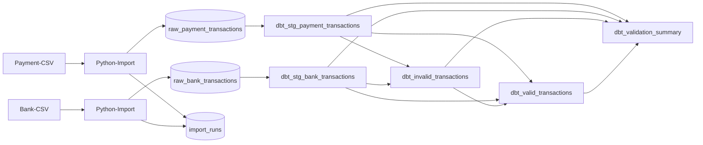
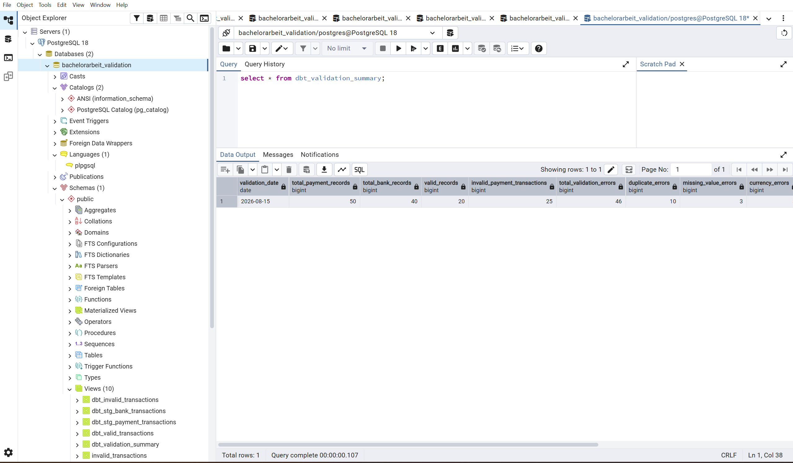
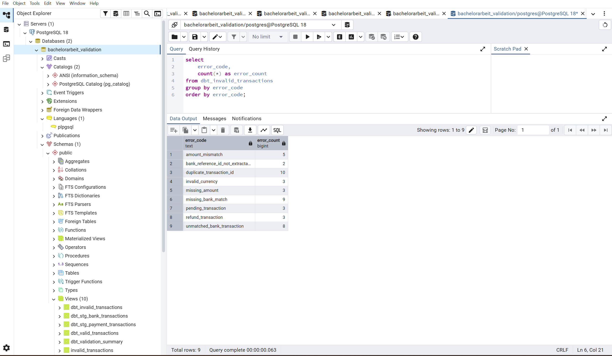

# Transaktionsvalidierung mit Python, PostgreSQL und dbt

Eine ELT-Pipeline zum Abgleich von Payment-Provider-Daten und Bankbuchungen.
Python importiert zwei synthetische CSV-Dateien. PostgreSQL und dbt bereiten die
Daten auf, wenden neun fachliche Prüfregeln an und liefern gültige Transaktionen,
Fehlerzeilen und eine Zusammenfassung.

Das Projekt entstand als Bachelorarbeit an der HTW Berlin und wird als Portfolio
weiterentwickelt. Der CSV-Pfad ist die ausführbare Hauptpipeline. Der enthaltene
Stripe-Test-API-Import ist ein separater Proof of Concept und fließt nicht in diese
Validierung ein.

## Technischer Schwerpunkt

| Bereich | Umsetzung |
|---|---|
| Data Engineering | Python-Importe, explizite Datenbanktransaktionen, Importprotokoll, Rollback und ein Pipeline-Runner |
| Analytics Engineering | Fünf dbt-Views, Abhängigkeiten über `source()` und `ref()`, neun Prüfregeln und 22 dbt-Datentests |
| Qualitätssicherung | Zwei Python-Integrationstests für Rollback/Fehlerprotokollierung und zwei Unit-Tests für den Runner |
| Automatisierung | GitHub-Actions-Workflow mit separatem PostgreSQL-Testdienst und zwei vollständigen Pipeline-Läufen |

Die Workflow-Datei allein belegt keinen erfolgreichen CI-Lauf. Den tatsächlichen
Status zeigt [GitHub Actions](https://github.com/Titi9625/sql-transaktionsvalidierung/actions).

## Datenfluss


```mermaid
flowchart LR
    P[Payment-CSV] --> IP[Python-Import]
    B[Bank-CSV] --> IB[Python-Import]
    IP --> RP[(raw_payment_transactions)]
    IB --> RB[(raw_bank_transactions)]
    IP --> L[(import_runs)]
    IB --> L
    RP --> SP[dbt_stg_payment_transactions]
    RB --> SB[dbt_stg_bank_transactions]
    SP --> I[dbt_invalid_transactions]
    SB --> I
    SP --> V[dbt_valid_transactions]
    SB --> V
    I --> V
    SP --> S[dbt_validation_summary]
    SB --> S
    I --> S
    V --> S
```

Die fünf dbt-Modelle werden als normale PostgreSQL-Views angelegt. Die Views
speichern Abfragelogik; die Zusammenfassung ist keine historische Ergebnistabelle.
`import_runs` speichert dagegen den Verlauf der Importversuche dauerhaft.

## Erwartete Ergebnisse des mitgelieferten Testdatensatzes

| Kennzahl | Erwarteter Wert |
|---|---:|
| Payment-Datensätze | 50 |
| Bank-Datensätze | 40 |
| Gültige Ergebniszeilen | 20 |
| Unterschiedliche Payment-IDs mit mindestens einem Fehler | 25 |
| Fehlerzeilen insgesamt, über beide Quellen | 46 |
| dbt-Views / dbt-Datentests | 5 / 22 |

Eine Transaktion kann mehrere Fehler erzeugen. 46 Fehlerzeilen bedeuten daher
nicht 46 unterschiedliche Transaktionen. Die Daten enthalten absichtliche
Duplikate und andere Fehler; diese sollen erkannt und nicht vorab entfernt werden.
Die festen Erwartungswerte stehen in
[`assert_dbt_validation_summary_expected_values.sql`](dbt_validation_pipeline/tests/assert_dbt_validation_summary_expected_values.sql).

Historische Screenshots aus der Thesis:

<p>
  
  
</p>

## Lokal starten: Windows / PowerShell

Voraussetzungen: Git, Python 3.13 und ein laufender PostgreSQL-18-Server.
Die Python-Paketversionen sind in [`requirements.txt`](requirements.txt) festgelegt.

### 1. Repository und Python-Umgebung

```powershell
git clone https://github.com/Titi9625/sql-transaktionsvalidierung.git
cd sql-transaktionsvalidierung
git switch portfolio-improvements
python -m venv .venv
.\.venv\Scripts\python.exe -m pip install -r requirements.txt
```

Die Portfolio-Erweiterungen werden zunächst auf `portfolio-improvements`
entwickelt. Dieser Branch muss auf GitHub veröffentlicht sein, damit der Wechsel
nach einem neuen Clone funktioniert. Nach dem Merge nach `main` entfällt der
Branch-Wechsel. Bei einer vorhandenen Arbeitskopie nicht erneut klonen.

### 2. Datenbank und Einstellungen

In pgAdmin eine separate Datenbank `portfolio_validation` anlegen.
Dann im Repository-Stammordner:

```powershell
Copy-Item .env.example .env
notepad .env
```

Nur bei der Ersteinrichtung kopieren; eine vorhandene `.env` nicht überschreiben.
Host, Port, Benutzer und Passwort passend zum lokalen PostgreSQL-Server eintragen.
`DB_NAME=portfolio_validation` verwenden. Ein Stripe-Schlüssel ist nicht nötig.
`.env` enthält lokale Zugangsdaten und wird von Git ignoriert.

Im Query Tool von **portfolio_validation** diese Dateien nacheinander öffnen und
ausführen:

1. [`sql_views/00_create_raw_tables.sql`](sql_views/00_create_raw_tables.sql)
2. [`sql_views/04_create_import_runs.sql`](sql_views/04_create_import_runs.sql)

Das vorhandene Rohdaten-Skript weist die Tabellen dem Benutzer `postgres` zu;
für diesen lokalen Aufbau als `postgres` ausführen. Eine produktive Installation
braucht ein angepasstes Rollen- und Rechtekonzept.

### 3. Vollständige Pipeline ausführen

```powershell
.\.venv\Scripts\python.exe .\run_pipeline.py
```

Der Runner prüft die dbt-Verbindung, lädt beide CSV-Dateien und führt `dbt build`
aus. Er erzeugt ein temporäres dbt-Profil aus derselben `.env`, die auch die
Importer verwenden. Eine zusätzliche manuelle `profiles.yml` ist dafür nicht
nötig. Der temporäre Profilordner wird bei normalem Programmende entfernt.

Erwarteter Abschluss: `PASS=27`, `ERROR=0` und `Pipeline completed successfully.`
Die 27 erfolgreichen Aufgaben sind **5 Modelle plus 22 Tests**, nicht 27 Tests.
Die Rückgabe des Runners ist bei Erfolg 0, bei einem fehlgeschlagenen Schritt 1.

### 4. Python-Tests ausführen

Nach einem erfolgreichen Import:

```powershell
.\.venv\Scripts\python.exe -m unittest discover -s tests -v
```

Die Suite enthält vier Tests. Die beiden Integrationstests verlangen ausdrücklich
`portfolio_validation`, erzeugen kontrollierte Importfehler nach dem ersten
INSERT und vergleichen die vollständigen Tabelleninhalte vor und nach dem
Rollback. Sie hinterlassen absichtlich zwei `failed`-Einträge im Importprotokoll.
Die CSV-Dateien werden dabei nicht verändert. Währenddessen keine anderen
Importe oder Tests gegen dieselbe Datenbank starten.

### 5. Ergebnisse ansehen

In pgAdmin, verbunden mit `portfolio_validation`:

```sql
SELECT * FROM public.dbt_validation_summary;

SELECT run_id, file_name, target_table, started_at, finished_at,
       status, rows_imported, error_message
FROM public.import_runs
ORDER BY run_id DESC;
```

## Verhalten bei Wiederholung und Fehlern

- Jeder CSV-Import ersetzt den Inhalt seiner Rohdatentabelle mit `TRUNCATE` und
  anschließendem `INSERT`. Wiederholtes Laden hängt keine weiteren Datenzeilen an.
  Die absichtlichen Duplikate innerhalb der Quelldatei bleiben erhalten.
- Die fachlichen Quelldaten bleiben bei gleicher Eingabe gleich; `imported_at`
  und die neuen Protokolleinträge ändern sich. Es gibt noch keine Erkennung bereits
  geladener Dateien über Hashes oder Batch-IDs und keine inkrementelle Beladung.
- Vor dem Import wird ein `running`-Eintrag gespeichert. Daten und `success`-Update
  werden gemeinsam committed. Bei einem abgefangenen Fehler werden die Daten
  zurückgerollt und ein `failed`-Eintrag mit 0 committed Zeilen gespeichert.
- Das Fehlerfeld enthält den Exception-Typ, nicht den vollständigen Fehlertext.
  Ein Verbindungsfehler vor Beginn kann nicht in derselben Datenbank protokolliert
  werden. Ein Prozessabbruch oder Verbindungsverlust kann `running` zurücklassen.
- Payment- und Bank-Import sind getrennte Transaktionen. Ein späterer Fehler macht
  einen vorher erfolgreichen Import nicht rückgängig. Der Runner stoppt dann;
  die Pipeline ist keine gemeinsame Transaktion über alle Schritte.
- dbt verwendet im Runner einen Thread. Bei parallelem Ersetzen abhängiger Views
  trat lokal ein Deadlock auf; anschließende sequenzielle Wiederholungen waren
  erfolgreich. Mehrere Pipeline-Prozesse gegen dieselbe Datenbank werden noch
  nicht durch eine übergreifende Sperre verhindert.

## Automatische Prüfung auf GitHub

[`data-pipeline.yml`](.github/workflows/data-pipeline.yml) ist für Pushes auf
`main` und `portfolio-improvements`, Pull Requests nach `main` und manuelle Starts
konfiguriert. Der Job nutzt einen frischen PostgreSQL-18-Service, installiert
die Projektabhängigkeiten, erstellt Tabellen und eine CI-eigene `.env`, führt
die Pipeline zweimal aus und startet anschließend die vier Python-Tests.

Die im Workflow angegebenen Zugangsdaten gelten nur für den kurzlebigen
Testdienst. Die lokale Datenbank und persönliche Zugangsdaten werden nicht
verwendet. Ein erfolgreicher Lauf zeigt Reproduzierbarkeit in dieser
Testumgebung; er belegt keinen produktiven Betrieb.

Grundlage für den Testdienst:
[GitHub-Dokumentation zu PostgreSQL-Service-Containern](https://docs.github.com/en/actions/tutorials/use-containerized-services/create-postgresql-service-containers).

## Wichtige Dateien

| Pfad | Aufgabe |
|---|---|
| `run_pipeline.py` | Aktueller Einstiegspunkt für Importe und dbt |
| `python_import/import_*_csv_large.py` | Aktuelle CSV-Importer mit Transaktionen und Protokollierung |
| `python_import/import_logging.py` | Start, Erfolg und Fehler eines Importversuchs speichern |
| `sql_views/00_create_raw_tables.sql` | Drei Rohdatentabellen anlegen; API-Tabelle bleibt im CSV-Pfad leer |
| `sql_views/04_create_import_runs.sql` | Importprotokoll anlegen |
| `dbt_validation_pipeline/models/` | Zwei Staging-, zwei Validierungs- und ein Zusammenfassungsmodell |
| `dbt_validation_pipeline/models/_schema.yml` | Generische dbt-Tests |
| `dbt_validation_pipeline/tests/` | Zwei projektspezifische SQL-Tests |
| `tests/` | Python-Tests für Rollback/Logging und Runner |
| `testdaten/` | Mitgelieferte synthetische CSV-Daten |
| `.github/workflows/data-pipeline.yml` | CI-Konfiguration |
| `ergebnisse/screenshots/` | Historische Nachweise aus der Thesis |

Die kleinen CSV-Importer, der Generator, das bisherige PowerShell-Skript und der
Stripe-API-Code sind historisches Thesis-Material und werden vom neuen Runner
nicht aufgerufen. Sie können noch Pfade zur ursprünglichen Ordnerstruktur enthalten.
Die eigenständigen SQL-Views in `sql_views/01_...` und `02_...` sind ebenfalls eine
separate Umsetzung. Ihre Regeln sind nicht vollständig identisch mit den
dbt-Modellen; sie werden für den hier dokumentierten Ablauf nicht ausgeführt.

## Grenzen und nächste Schritte

- Kleine, synthetische Testdaten; kein Nachweis für produktive Zahlungsabwicklung,
  große Datenmengen oder beliebige Bankformate.
- Referenzbasierter Einzelabgleich; keine vollständige Modellierung von
  Sammelauszahlungen, Auszahlungszyklen oder Währungsumrechnungen.
- Pending-Zahlungen und Refunds sind fachliche Ausnahmen im gewählten Szenario;
  sie sind nicht automatisch fehlerhafte reale Zahlungen.
- Die neun Prüfregeln und festen Ergebnis-Tests decken das Testszenario ab;
  weitere Nullwerte, Statuswerte und Randfälle benötigen zusätzliche Regeln/Tests.
- Kein Scheduler, kein fachlicher Reporting-Mart und kein Dashboard im aktuellen
  Runner. Geplante Erweiterungen sind dokumentierte Kennzahlen und ein Reporting-Mart.

Thesis: *SQL-basierte Validierung von Transaktionsdaten aus Payment-Provider-APIs
und Bankexporten für eine zuverlässige Finanzberichterstattung*,
HTW Berlin, Ingenieurinformatik. Lizenz: [MIT](LICENSE).
